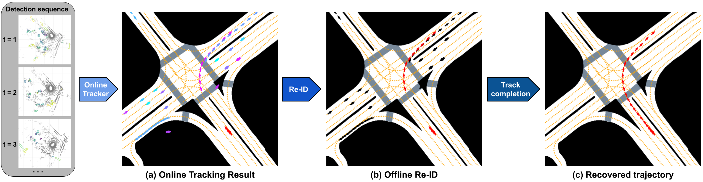
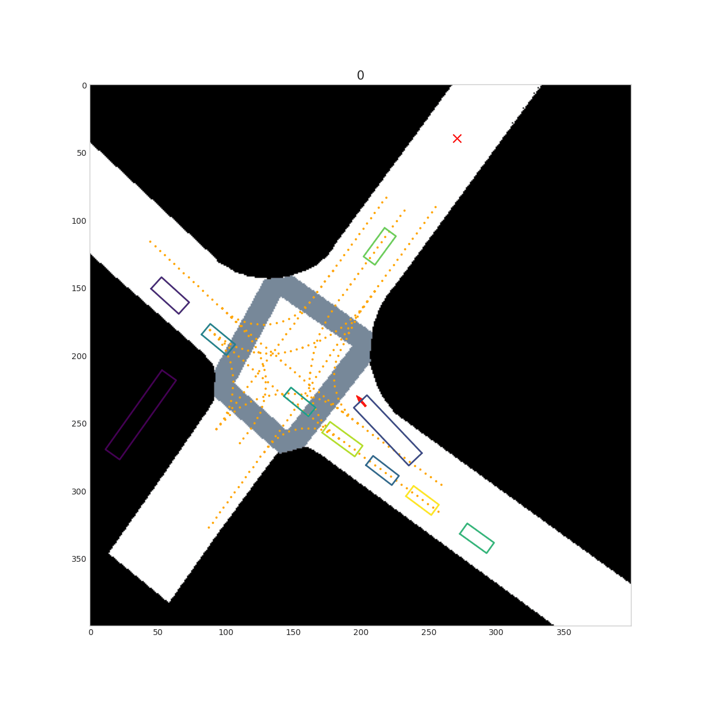
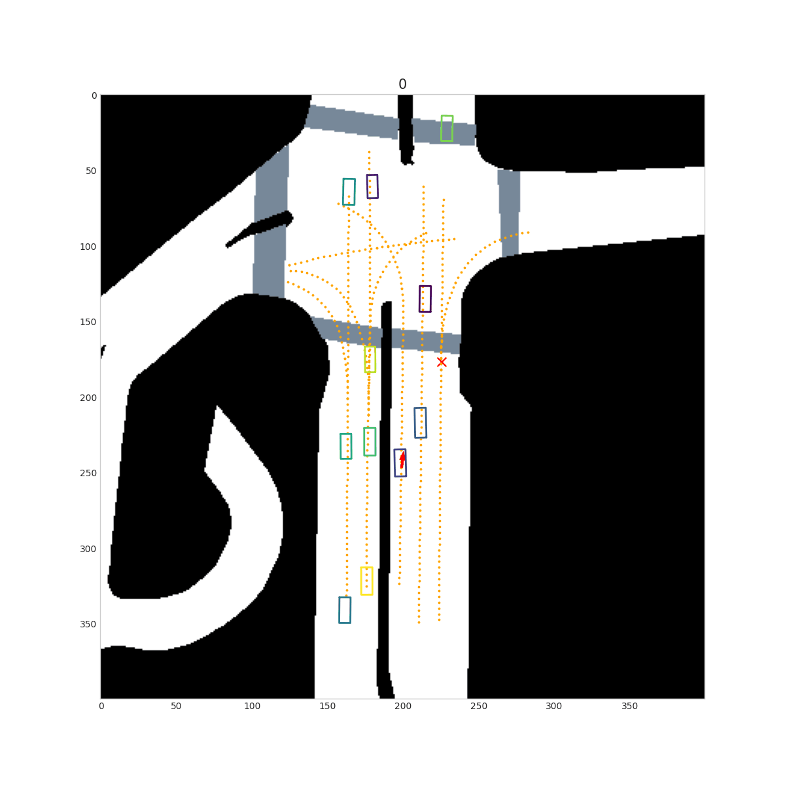
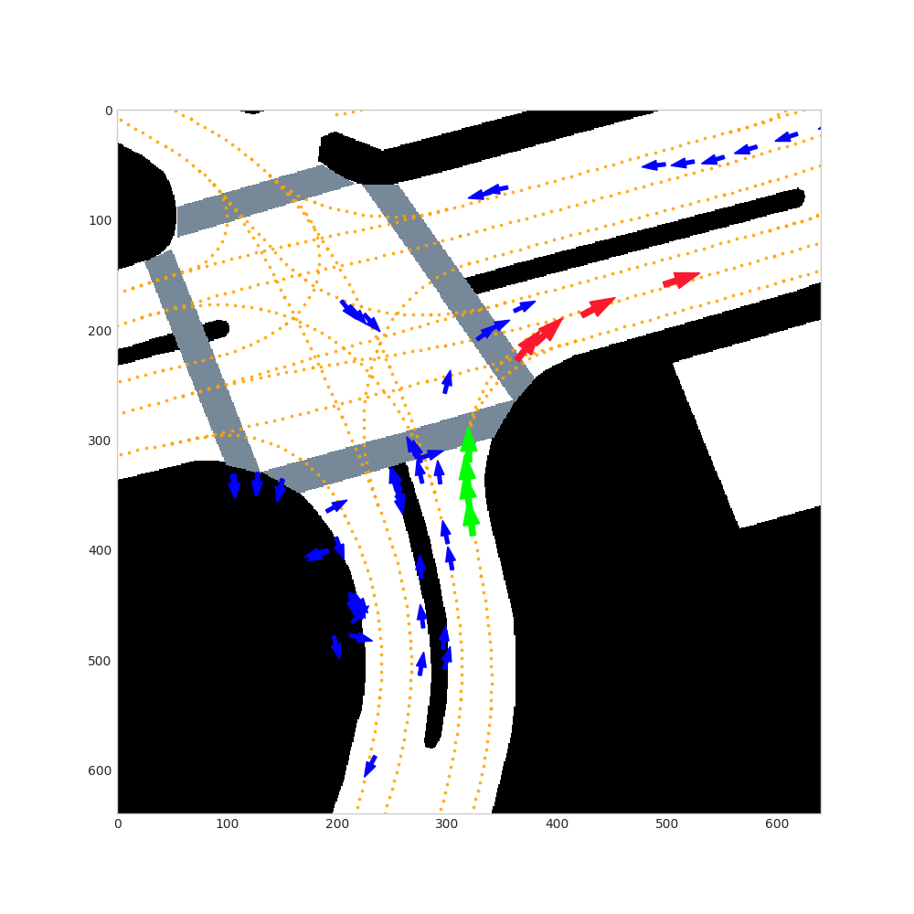

# Offline Tracking with Object Permanence

## Introduction

This repository contains code for ["Offline Tracking with Object Permanence"](https://arxiv.org/abs/2310.01288) by Xianzhong Liu, Holger Caesar.  This project aims to recover the occluded vehicle trajectories and reduce the identity switches caused by occlusions.

## Overview

<p align="center">
    
    A brief overview of the offline tracking model. (a) Online tracking result: Each tracklet is represented by a different color (history tracklet: red). (b) Offline Re-ID : The matched pair of tracklets are red. The unmatched ones are black. (c) Recovered trajectory.
</p>

Our model initially takes the detections from a detector as input. Then it uses an off-the-shelf online tracker to associate detections and generate initial tracklets. Here, we use [CenterPoint](https://github.com/tianweiy/CenterPoint) as the online detector and initial tracker. Next, the Re-ID module tries to associate the possible future tracklets with the terminated history tracklet. If a pair of tracklets are matched, the track completion module interpolates the gap between them by predicting the location and orientation of the missing boxes. Both modules extract motion information and lane map information to produce accurate results. The model finally outputs the track with refined new identities and completes the missing segments within the tracks. 

## Performance
### Re-ID result
We benchmarked our Re-ID result on the nuScenes test split. The result is shown below and at the [leaderboard](https://nuscenes.org/tracking?externalData=all&mapData=all&modalities=Any). We used [CenterPoint](https://github.com/tianweiy/CenterPoint) as our base detector.

**We only applied our method to vehicle tracks. For non-vehicle tracks, we keep the original CenterPoint tracking (with NMS). Therefore, results on non-vehicle classes (i.e. bicycle, motorcycle and pedestrian) should be ignored.**
<p align="middle">

|   Re-ID Result on Test Split    | AMOTA (%) $\uparrow$| AMOTP (m) $\downarrow$ |   TP $\uparrow$ |   FP $\downarrow$ |   FN $\downarrow$ | IDS $\downarrow$|
|:-------------------------------:|:--------:|:--------:|:-----:|:-----:|:-----:|-----|
| [CenterPoint](https://github.com/tianweiy/CenterPoint)  |   69.7  |   0.596  | $\mathbf{66725}$ | 12788 | $\mathbf{14359}$ | 340 |
| [Immortal Tracker](https://github.com/ImmortalTracker/ImmortalTracker) |   70.5   |   0.609  | 66511 | 12133 | 14758 | $\mathbf{155}$ |
| Offline Re-ID |   $\mathbf{73.4}$   |   $\mathbf{0.532}$  | 66644 | $\mathbf{11418}$ | 14576 | 204 |

</p>

By the time of submission, the model ranks <mark>5<sup>th</sup></mark> among lidar-based methods and <mark>2<sup>nd</sup></mark> among methods using CenterPoint detections (we only compare vehicle classes).

### Track completion result
We show the quantitative results on the validation split over the vehicle classes. We modified the evaluation protocol so that occluded GT boxes are not filtered.

> The track completion model theoretically interpolates non-linear trajectories between fragmented tracklets. However, the standard nuScenes evaluation first filters out the occluded GT boxes then linearly interpolates the occluded trajectories. Therefore, we modified the standard evaluation protocol and evaluate the track completion result locally on the validation split so that occluded GT boxes are retained for evaluation. Note that our models are trained and tuned on the train split. Similarly, we still focus on vehicle tracks.

<p align="middle">

|   Track Completion Result on Val Split    | AMOTA (%) $\uparrow$|    TP $\uparrow$ |   FP $\downarrow$ |   FN $\downarrow$ | 
|:-------------------------------:|:--------:|:-----:|:-----:|:-----:|
| [CenterPoint](https://github.com/tianweiy/CenterPoint) | 70.2 | 59332 | $\mathbf{8 1 9 7}$ | 14704 |
| [Immortal Tracker](https://github.com/ImmortalTracker/ImmortalTracker) | 72.3 | 59271 | 9593 | 14883 |
| Offline Track Completion |   $\mathbf{72.4}$   |  $\mathbf{60675}$ | 8953 | $\mathbf{13432}$ | 

</p>


## Visualization
We show visualization results of the final recovered trajectories from occlusions as blue arrows.  
<p align="middle">

</p>

* Rectangles: GT boxes.

* <span style="color:blue">Blue arrows</span>: recovered box centers which are originally missing in the initial tracking result. 

* <span style="color:red">Red arrows</span>: visible box centers in initial online tracking.


# Getting Started
We provide the instructions on how to install and run our project.

## Installation
0. Install [Python](https://python.land/installing-python) and [Anaconda](https://docs.anaconda.com/free/anaconda/install/index.html) (or [miniconda](https://docs.conda.io/projects/miniconda/en/latest/))

1. Clone this repository 

2. Set up a new conda environment 
``` shell
conda create --name offline_trk python=3.7
```

3. Install dependencies
```shell
conda activate offline_trk

# nuScenes devkit
pip install nuscenes-devkit

# Pytorch: The code has been tested with Pytorch 1.7.1, CUDA 10.1, but should work with newer versions
conda install pytorch==1.7.1 torchvision==0.8.2 torchaudio==0.7.2 cudatoolkit=10.1 -c pytorch

```


## Dataset Preparation

1. Download the [nuScenes dataset](https://www.nuscenes.org/download). For this project we need the following.
    - Metadata for the Trainval split (v1.0)
    - Metadata for the Test split (v1.0) (Optional)
    - Map expansion pack (v1.3)

2. Organize the nuScenes root directory as follows
```plain
└── nuScenes/
    ├── maps/
    |   ├── basemaps/
    |   ├── expansion/
    |   ├── prediction/
    |   ├── 36092f0b03a857c6a3403e25b4b7aab3.png
    |   ├── 37819e65e09e5547b8a3ceaefba56bb2.png
    |   ├── 53992ee3023e5494b90c316c183be829.png
    |   └── 93406b464a165eaba6d9de76ca09f5da.png
    ├── v1.0-trainval
    |   ├── attribute.json
    |   ├── calibrated_sensor.json
    |   ...
    |   └── visibility.json         
    └── v1.0-test (Optional)
        ├── attribute.json
        ├── calibrated_sensor.json
        ...
        └── visibility.json  
```


## Inference with online tracking result


### Generating the initial online tracking result
1. Download the [detection results](https://mitprod-my.sharepoint.com/:f:/g/personal/tianweiy_mit_edu/Eip_tOTYSk5JhdVtVzlXlyABDPnGx9vsnwdo5SRK7bsh8w?e=vSdija) in standard nuScenes submission format. (Note: the link is from [CenterPoint](https://github.com/tianweiy/CenterPoint). Any other detectors will also work as long as it fits the format.) The detection results can be saved in `./det_results/`.
2. Run the tracking script (TODO: add multiprocessing to make the nms faster)
```shell
python nusc_tracking/pub_test.py --work_dir mot_results  --checkpoint det_results/your_detection_result(json file) --nms --version v1.0-test --root path/to/nuScenes/root/directory
```
### Extract vehicle tracklets and convert to input format for Re-ID
3. Extract vehicle tracklets
```
python initial_extraction.py --cfg_file data_extraction/nuscenes_dataset_occ.yaml --version v1.0-test  --result_path mot_results/v1.0-test/tracking_result.json --data_root path/to/nuScenes/root/directory
``` 
4. Convert to Re-ID input, this may take several hours (TODO: add multiprocessing to make the extraction faster)
```
## Slower
#python nuscenes_dataset_match.py --cfg_file data_extraction/nuscenes_dataset_occ.yaml --data_root path/to/nuScenes/root/directory
## OR a faster way, but more requires computational resources 
bash Re-ID_extraction.sh path/to/nuScenes/root/directory
```
### Performing Re-ID
5. Reassociate history tracklets with future tracklets by changing the tracking ID of the future tracklets. The following command will generate the Re-ID result as a **.json** file, which can be evaluated directly using the standard evaluation code of nuScenes MOT.
```
python motion_matching.py --cfg_file motion_associator/re-association.yaml --result_path mot_results/v1.0-test/tracking_result.json --data_root path/to/nuScenes/root/directory
```

6. To visualize all the association result, run
```
python motion_matching.py --cfg_file motion_associator/re-association.yaml --result_path mot_results/v1.0-test/tracking_result.json --visualize --data_root path/to/nuScenes/root/directory
```
The plots will be stored under `./mot_results/Re-ID_results/matching_info/v1.0-test/plots`. Note that some times the detections are flipped for 180 degrees. 
<p align="center">
    
</p>

* <span style="color:green">Green arrows</span>: History tracklet. 

* <span style="color:blue">Blue arrows</span>: Future tracklets with low association scores. 


* <span style="color:red">Red arrows</span>: Future tracklets with high association scores. 

### Track completion
Complete the fragmented tracks by interpolating them. To change the split version, please change the cfg file `track_completion_model/track_completion.yaml`. First extract the data from the previous Re-ID results

```
python track_completion_ext.py --result_path mot_results/Re-ID_results/path/to/the/Re-ID/results.json --data_root path/to/nuScenes/root/directory
```
where `mot_results/Re-ID_results/path/to/the/RE-ID/results.json` is the path to Re-ID result.

Finally, perform track completioin over the Re-ID results. It will produce the final tracking reult under `mot_results/track_completion_results`.

```
python track_completion.py --result_path mot_results/Re-ID_results/path/to/the/Re-ID/results.json --ckpt_path track_completion_model/trained_completion_model.tar --data_root path/to/nuScenes/root/directory
```

## Training
We have already provided the trained Re-ID models under folder `./motion_associator` and track completion model under folder `./track_completion_model` as `.tar` files. Alternatively, you can also train yourself following the steps below.

1. Run the following commands to extract pre-processed data for Re-ID. This may take several hours. 
```shell
## Preprocess Re-ID data for training
python preprocess.py -c configs/preprocess_match_data.yml -r path/to/nuScenes/root/directory -d path/to/directory/with/preprocessed/Re-ID/data
```

2. Run the following commands to extract pre-processed data for track completion. 
```shell
 ## Preprocess track completion data for training
python preprocess.py -c configs/preprocess_track_completion_data.yml -r path/to/nuScenes/root/directory -d path/to/directory/with/preprocessed/track_completion/data
```


3. To train the Re-ID models from scratch, run
```shell
### Train map branch
python train.py -c configs/match_train_augment.yml -r path/to/nuScenes/root/directory -d path/to/directory/with/preprocessed/Re-ID/data -o motion_associator/map_branch -n 50
### Train motion branch (Optional)
python train.py -c configs/configs/match_train_augment_only_motion.yml -r path/to/nuScenes/root/directory -d path/to/directory/with/preprocessed/Re-ID/data -o motion_associator/motion_branch -n 50
```

4. To train the track completion model from scratch, run
```shell
python train.py -c configs/track_completion.yml -r path/to/nuScenes/root/directory -d path/to/directory/with/preprocessed/track_completion/data -o track_completion_model/ -n 50
```

5. The training script will save training checkpoints and tensorboard logs in the output directory. To launch tensorboard, run
```shell
tensorboard --logdir=path/to/output/directory/tensorboard_logs
```


# Acknowledgement
This project is built upon the following opensourced projects. We sincerely express our appreciation.

* [PGP](https://github.com/nachiket92/PGP)
* [LaneGCN](https://github.com/uber-research/LaneGCN)
* [LAFormer](https://github.com/mengmengliu1998/LAformer)
* [CenterPoint](https://github.com/tianweiy/CenterPoint)
* [OpenPCDet](https://github.com/open-mmlab/OpenPCDet)
* [nuScenes-devkit](https://github.com/nutonomy/nuscenes-devkit)

# Citation
Please use the following citation when referencing
```bibtex
@article{liu2023offline,
      title={Offline Tracking with Object Permanence}, 
      author={Xianzhong Liu and Holger Caesar},
      journal={arXiv preprint arXiv:2310.01288},
      year={2023}
}
```


